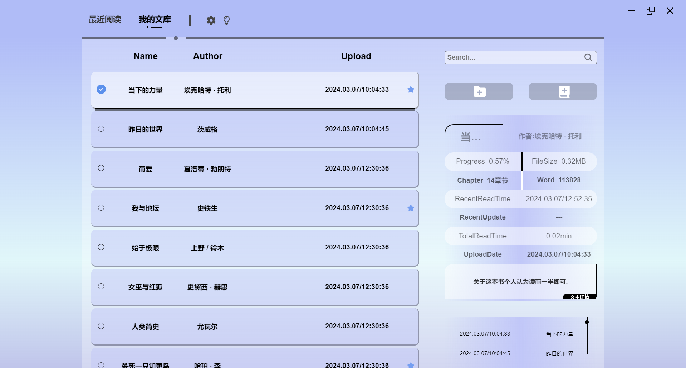
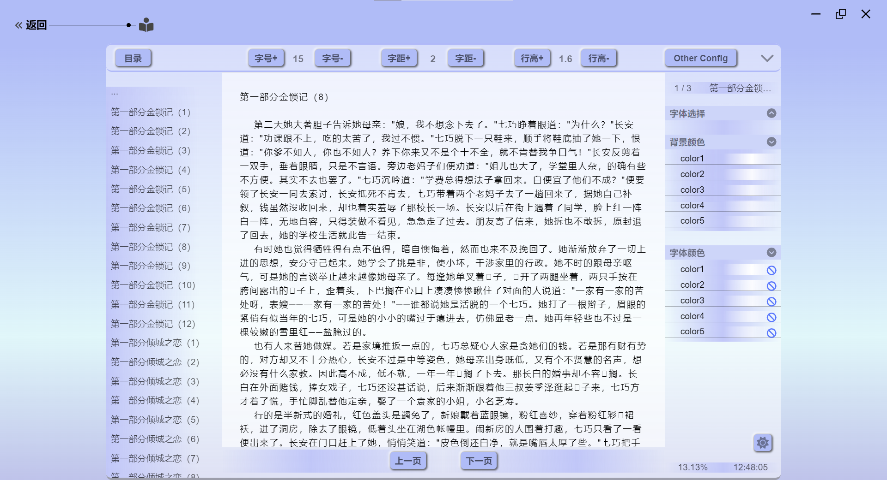
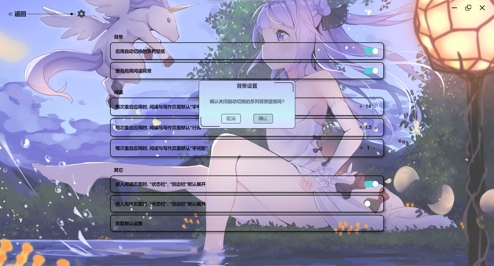

## 描述与功能

这是个小说阅读器, vue + electron开发, 是我以前的YuxiaohangReader1.0项目整体重构,
没有后端, 只是用一个json文件来储存元数据, 食用方法是支持用户从本地上传txt小说文本,
而项目只是提供一个阅读的界面(总之很没用就是了) ——关键是最后打包后还用不了(笑),
所以只能在开发环境使用(太丢脸了~), 终究人太菜~ 等将来学有所成, 我必定回来将他狠狠重新打包.

实现功能:
- 支持用户上传(utf-8), 或者自创作文章.
- 支持收藏, 进度, 目录生成, 搜索, 最近记录...等等乱七八糟一堆.

## 厚颜无耻截几张图
<br/>




## 项目背景

开发本项目的目的纯粹是为了学习vue和electron的相关知识, 代码质量...咳咳...
很多地方写着写着就莫名写笑了...代码风格, 技巧什么的, 肯定没有啦.

## 开发日期

2023.12.20 ~ 立项
2024.1.1 ~ 临近考试搁置一个多月...
2024.2.1 ~ 继续
2024.3.5 ~ 完工
前后实际开发时间, 一个月左右.

## 运行本项目
```shell
# 安装依赖
npm install
# 运行Vue服务
npm run dev
# 运行Electron客户端
npm start
```
```shell
# 打包
npm run dist
```

## 灵感来源或声明

 封面模仿"迷迭香的博客";
 设置页面模仿WPS设置页面;
 图片背景切换模仿"初音的青葱"(某galgame网站);
 特别感谢这位大佬, 本项目很多地方参考了他这个项目(https://github.com/Kaidesuyo/Hydrogen-Music)

 另, 所有壁纸图片均来源于网络;
 ...
